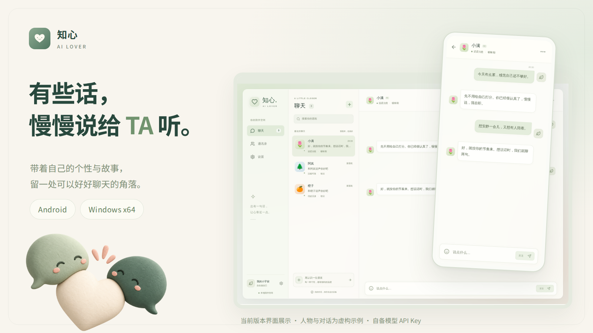
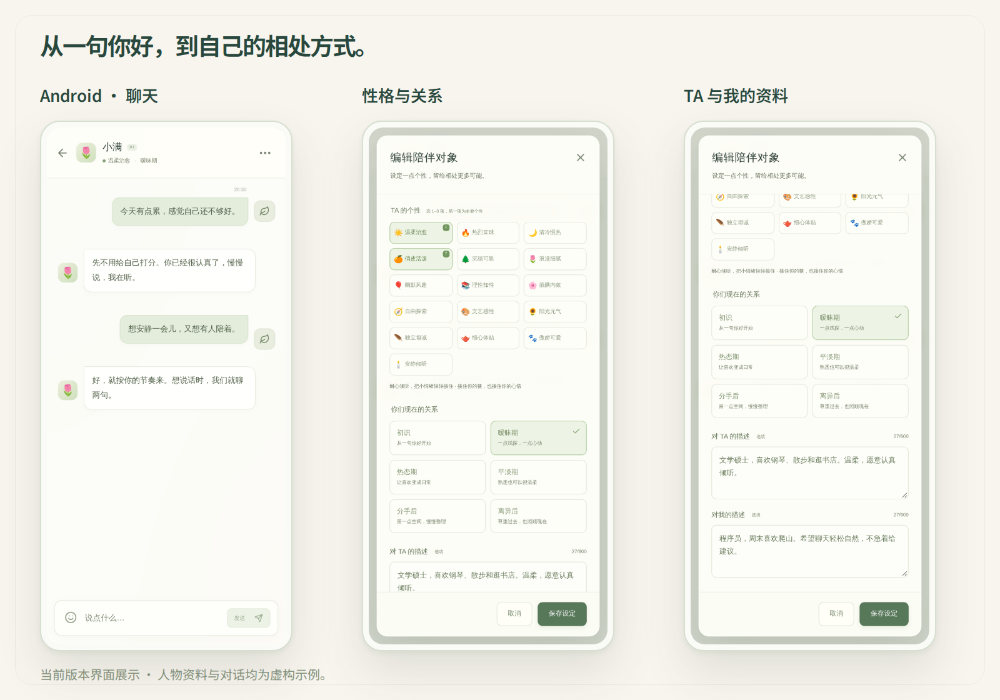

# 💬 知心 · AI Lover

[](https://github.com/BUG423/apps-ai-lover/releases)
[](https://github.com/BUG423/apps-ai-lover/actions)
[](https://www.electronjs.org/)
[](https://developer.android.com/)
[](https://www.typescriptlang.org/)
[](https://creativecommons.org/licenses/by-nc-nd/4.0/)

> **知心 · AI Lover** 是一款专为深度情绪陪伴打造的开源 AI 交互客户端。支持 Android 与 Windows x64 原生双端，用户可自由构建具有独立性格、身份设定与亲密阶段的专属伴侣，采用自带模型密钥（BYOK）架构，守护纯粹私密的对话空间。

---



---

## 📦 下载与安装

前往 **[GitHub Releases 最新发布页](https://github.com/BUG423/apps-ai-lover/releases/latest)** 获取客户端产物：

| 平台 | 交付文件 | 说明 |
|---|---|---|
| 📱 **Android 客户端** | `ai-lover-android-*.apk` | 支持 Android 8.0+ 手机与平板（实机适配优化） |
| 🖥️ **Windows 安装版** | `ai-lover-windows-*-setup.exe` | 包含桌面快捷方式与自动升级支持 |
| 💼 **Windows 便携版** | `ai-lover-windows-*-portable.zip` | 免安装解压即用，配置保存在本地目录 |

---

## ✨ 核心亮点

- **🎭 细腻个性与亲密演进**：
  - **16 种性格基调**：每位伴侣可自选 1–3 种个性标签，塑造独特语调与反应模式。
  - **6 阶关系演进**：从相识、熟稔到依恋，由你自主把控沟通距离与关系深度。
  - **双向人设档案**：独立维护「对 TA 的描述」与「对我的描述」，赋予大语言模型精准的互动态度与情境记忆。
- **🔐 纯粹本地与极致隐私**：
  - **自带密钥 (BYOK)**：用户使用个人服务商 API 密钥，直接与大模型服务交互，无第三方中转或日志拦截。
  - **本机安全存储**：API Key 与对话历史严格保存在本地设备加密沙箱中，不设云端同步，数据完全属于用户自己。
- **📱 跨平台沉浸交互**：
  - 界面去繁就简，留白克制，聚焦纯粹温润的文字陪伴。
  - 桌面端与移动端均可脱离外部依赖独立运行。

---



---

## ⚙️ 模型服务配置

应用支持主流高性能中文大模型服务商：

| 服务商 | 适用区域 / 特性 | API 密钥配置入口 |
|---|---|---|
| **小米 MiMo** | 国内高可用模型、沉浸对话调优 | [套餐控制台](https://platform.xiaomimimo.com/console/plan-manage) / [API 控制台](https://platform.xiaomimimo.com/console/api-keys) |
| **硅基流动 (SiliconFlow)** | 国内站、多样化开源大模型高速推理 | [硅基流动国内站控制台](https://cloud.siliconflow.cn/account/ak) |

> 💡 **提示**：源码与安装包不内置任何 API Key。首次启动时进入「设置」页面填写密钥，点击「测试连接」成功后即可畅快交流。

---

## 🚀 快速上手与运行

### 1. 环境准备与依赖安装

需要本地安装 Node.js 24+ 与 npm：

```bash
# 克隆仓库
git clone git@github.com:BUG423/apps-ai-lover.git
cd apps-ai-lover

# 安装工程依赖
npm ci
```

### 2. 本地开发与测试

```bash
# 启动本地开发服务
npm run dev

# 运行自动化测试套件
npm run test
```

### 3. 多端构建

```bash
# 构建 Android 原生包（需 JDK 21 及 Android SDK）
npm run android:build

# 构建 Windows 安装包与便携版（需在 Windows 环境下运行）
npm run windows:build
```

---

## 📄 知识产权与开源协议

本项目遵循 **[Creative Commons Attribution-NonCommercial-NoDerivatives 4.0 International (CC BY-NC-ND 4.0)](https://creativecommons.org/licenses/by-nc-nd/4.0/)** 严格非商业开源许可：

- ❌ **严禁商用**：任何个人或组织不得将本项目源码、编译产物或衍生版本用于任何商业盈利目的。
- ❌ **禁止演绎与分发修改版**：未经授权不得散布基于本项目修改后的二次分发版本。
- 🔒 **权利保留**：作者保留对本项目代码与架构的所有版权与法律追责权利。
