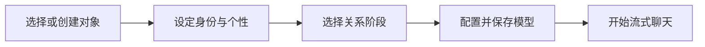

<p align="center">
  
</p>

<p align="center">
  <a href="https://github.com/BUG423/ai-lover/actions/workflows/ci.yml"></a>
  
  
</p>

<p align="center">
  <a href="#界面预览">界面预览</a> ·
  <a href="#手机使用">手机使用</a> ·
  <a href="#快速开始">快速开始</a> ·
  <a href="#测试与验证">测试与验证</a> ·
  <a href="#设计与架构">设计与架构</a>
</p>

**知心是一款支持电脑和手机的 AI 陪伴应用。** 微信式聊天、通讯录和设置，配合苹果磨砂玻璃视觉；为不同对象设定个性和关系，用自己的模型 API Key 开始对话。

## 一眼了解

| 🌷 定义你的陪伴            | 💬 自然地聊下去              | 🗝️ 自己掌握设置                  |
| -------------------------- | ---------------------------- | -------------------------------- |
| 多对象，分别保存设定与聊天 | 流式显示，边生成边阅读       | 自带 API Key，自选模型           |
| 双方各 4 种身份，16 种组合 | 每次携带当前对象的近期上下文 | 国际站、国内站及受信的兼容服务   |
| 16 种性格，可组合 1–3 项   | 停止回复、失败重试、表情输入 | 本机密钥加密、聊天备份导入导出   |
| 6 个关系阶段、可选背景     | 对象设定可随时修改           | 桌面三栏，手机底部导航与单页对话 |

## 界面预览

### 电脑端

会话列表和聊天并排显示；左侧切换聊天、通讯录与设置。

[](docs/screenshots/chat.png)

### 手机端

底部导航连接聊天、通讯录和设置；点开对象后进入单页对话，顶部返回列表。创建和设置表单可在手机上滚动操作。

[](docs/screenshots/mobile-gallery.png)

| 页面        | 你可以做什么                           | 查看原图                                           |
| ----------- | -------------------------------------- | -------------------------------------------------- |
| 💬 聊天     | 选择对象、输入消息、阅读回复、返回列表 | [手机聊天](docs/screenshots/mobile-chat.png)       |
| 🌷 创建对象 | 配置双方身份、个性、关系和背景         | [创建表单](docs/screenshots/mobile-create.png)     |
| 👥 通讯录   | 查找对象、查看资料、编辑设定、开始对话 | [手机通讯录](docs/screenshots/mobile-contacts.png) |
| ⚙️ 设置     | 填写 Key、选择模型、测试并保存连接     | [手机设置](docs/screenshots/mobile-settings.png)   |

以上为应用实际页面截图。手机截图使用浏览器触摸设备模拟；真实设备测试范围见下方验证说明。

<details>
<summary>展开查看电脑端设置</summary>

[](docs/screenshots/settings.png)

</details>

## 手机使用

**在手机浏览器中打开已部署的 HTTPS 网址，即可使用同一个应用。** 手机上的 `localhost` 指向手机自身；电脑启动后的 `http://localhost:5173` 用于电脑本机访问。

| 平台          | 打开方式                    | 添加到桌面                                                   |
| ------------- | --------------------------- | ------------------------------------------------------------ |
| iPhone / iPad | Safari 打开应用网址         | 分享菜单 →「添加到主屏幕」                                   |
| Android       | Chrome 等浏览器打开应用网址 | 浏览器菜单 →「安装应用」或「添加到主屏幕」，名称因浏览器而异 |
| 电脑          | 浏览器打开应用网址          | 支持 PWA 的浏览器可使用地址栏安装入口                        |

添加后可从桌面图标打开。PWA 安装与本机密钥加密需要安全上下文，正式部署请使用 HTTPS。离线可以查看已缓存页面和本机记录；生成新回复需要联网。

**数据按浏览器和设备保存。** 电脑与手机不会自动同步，迁移时在设置中导出/导入备份；API Key 不包含在备份中，新设备需要单独填写。

## 快速开始

### 1 · 启动应用

需要 **Node.js 24+**。

```bash
git clone https://github.com/BUG423/ai-lover.git
cd ai-lover
npm ci
npm run dev
```

电脑打开 **http://localhost:5173**。首次预置可编辑对象「小满」，你也可以创建新对象；未填写 Key 时可以浏览和设置对象，聊天会引导配置 API。

### 2 · 连接模型

进入「设置」，选择服务区域，填入对应区域的 API Key，读取模型或手动输入模型名称，测试连接后保存。连接测试会实际生成极短文本，产生少量调用费用。

| 服务                      | 接口地址                         | 获取密钥 / 教程                                                                                                             |
| ------------------------- | -------------------------------- | --------------------------------------------------------------------------------------------------------------------------- |
| **硅基流动国际站 · 默认** | `https://api.siliconflow.com/v1` | [创建 Key](https://cloud.siliconflow.com/account/ak) · [官方教程](https://docs.siliconflow.com/en/userguide/quickstart)     |
| 硅基流动国内站            | `https://api.siliconflow.cn/v1`  | [创建 Key](https://cloud.siliconflow.cn/account/ak) · [官方教程](https://api-docs.siliconflow.cn/docs/userguide/quickstart) |
| OpenAI 兼容服务           | 服务商的受信 `/v1` 地址          | 部署者按[生产运行](#生产运行)配置允许域名                                                                                   |

默认模型为 **`Qwen/Qwen3.5-9B`**。国际站价格研究快照（2026-10-03）：输入 **$0.10**、输出 **$0.15 / 百万 token**，以[官网价格](https://www.siliconflow.com/pricing)和实际账户为准；可用模型通过自己的 Key 实时读取。

### 3 · 创建对象，开始聊天



双方均可选男性、女性、无法被定义或动物；动物形态补充种类。性格第一项为主、其余辅助。关系阶段包括初识、暧昧、热恋、平淡、分手后和离异后。背景选填，最多 600 字。

## 测试与验证

| 验证层级            | 检查内容                                                                                               |
| ------------------- | ------------------------------------------------------------------------------------------------------ |
| 🧪 单元与服务测试   | 98 项：16 种身份组合、提示词、上下文预算、流式分包、超时、取消、密钥脱敏与地址校验                     |
| 🖥️ 基础浏览器回归   | 9 条流程：对象管理、API 设置、加密恢复、备份、独立上下文、错误重试、长对话与状态竞争                   |
| 📱 手机触摸冒烟测试 | 3 条流程通过：320 / 390 / 412 像素宽度，覆盖导航、创建、设置、聊天和刷新恢复；检查水平溢出与操作可见性 |
| 📦 生产启动与 PWA   | Node 生产页面、健康接口、API 404、静态资源缓存与离线页面恢复                                           |
| ✅ GitHub Actions   | 每次推送执行格式检查、单元测试、生产构建及桌面/手机浏览器测试                                          |

```bash
npm run typecheck
npm run format:check
npm test
npm run build
npx playwright install chromium
npm run test:e2e
```

仅检查手机流程：

```bash
npm run test:e2e -- --project=mobile-chromium
```

[查看最新自动测试结果](https://github.com/BUG423/ai-lover/actions/workflows/ci.yml) · [本轮冒烟测试记录](docs/smoke-tests.md)。浏览器测试使用受控模拟模型响应，不消耗真实供应商余额。移动端验证使用 Chromium 触摸模拟，尚未覆盖真实 iPhone / Android 设备或 Safari 引擎；没有用户 API Key，默认模型的实际角色表现和网络延迟仍待实测。

## 生产运行

```bash
npm run build
npm start
```

应用与 API 统一在 **http://localhost:3001** 提供。对外部署使用 HTTPS；反向代理关闭 SSE 缓冲，读取超时应大于 90 秒。

<details>
<summary>Docker 部署</summary>

```bash
docker compose up --build -d
```

Docker 配置已提供；当前交付环境没有 Docker，容器构建未实测。Node 生产服务已实际启动验证。

</details>

<details>
<summary>接入其他 OpenAI 兼容服务</summary>

默认允许硅基流动国际站、中国站和 `https://api.openai.com/v1`。添加其他兼容供应商时，部署者通过环境变量显式配置信任其 HTTPS origin：

```bash
ALLOWED_API_ORIGINS=https://api.example.com npm start
```

设置中的接口地址需使用该 origin 的 `/v1` 路径。`PORT` 可覆盖默认的 3001，环境配置示例见 [.env.example](.env.example)。

</details>

<details>
<summary>数据与首版范围</summary>

对象与完整聊天历史属于当前浏览器，模型每轮只获得当前对象的设定和预算内的近期消息。API 代理不持久保存聊天和密钥，会按需转发给所选供应商；部署服务器必须可信。

API Key 通过本机设备密钥加密保存，并从聊天备份中排除；加密无法抵御已控制同源页面或设备的攻击。清理浏览器、隐私模式或换设备可能无法保留原数据，请使用备份迁移。

首版提供 Web/PWA 和桌面/手机响应式界面。跨设备账号同步、语音、群聊、主动推送和自动长期记忆尚未实现。

</details>

## 设计与架构

| 文档                                     | 内容                                                       |
| ---------------------------------------- | ---------------------------------------------------------- |
| [竞品与模型调研](docs/research.md)       | Character.AI、Replika、Nomi、Kindroid 的官方资料与选型依据 |
| [产品需求](docs/product-requirements.md) | 多对象、身份、性格、关系阶段与验收要求                     |
| [架构设计](docs/architecture.md)         | 数据流、领域模型、上下文预算与架构决策                     |
| [模型网关](docs/backend.md)              | 接口契约、流式协议、失败和取消策略                         |
| [进度与验证记录](docs/progress.md)       | 已完成工作、验证结果与尚未实测的范围                       |
