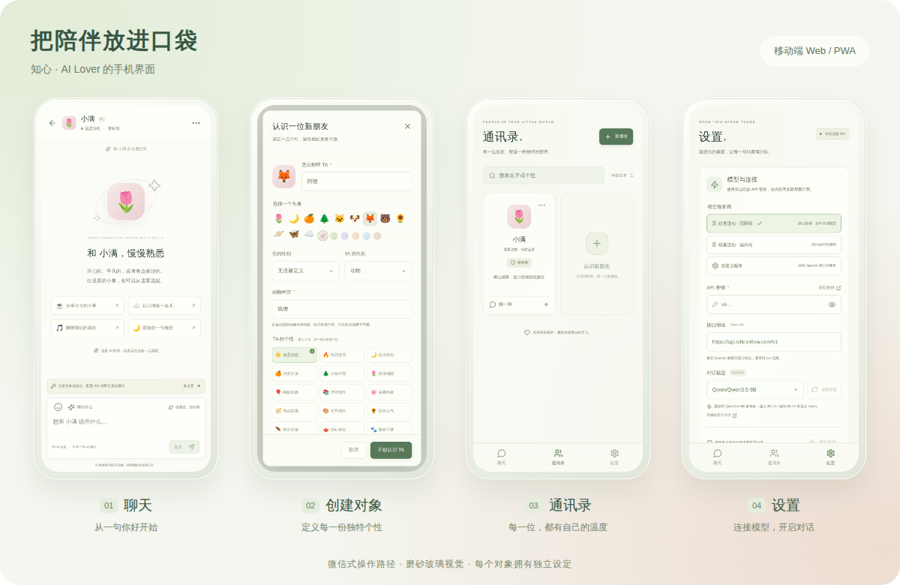
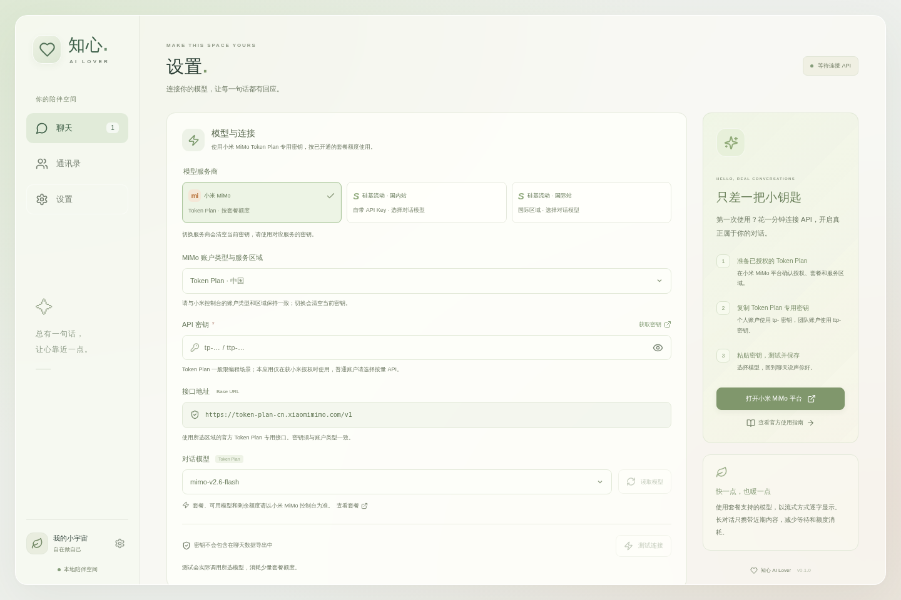
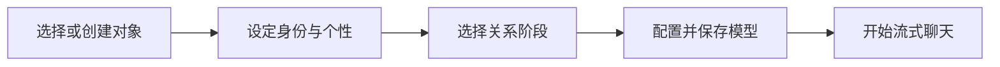

<p align="center">
  
</p>

<p align="center">
  <a href="https://github.com/BUG423/ai-lover/actions/workflows/ci.yml"></a>
  
  
  
</p>

<p align="center">
  <a href="#界面预览">界面预览</a> ·
  <a href="#手机使用">手机使用</a> ·
  <a href="#快速开始">快速开始</a> ·
  <a href="#测试与验证">测试与验证</a> ·
  <a href="#设计与架构">设计与架构</a>
</p>

**知心是一款可安装到安卓手机的 AI 陪伴应用，也提供电脑网页预览。** 微信式聊天、通讯录和设置，配合苹果磨砂玻璃视觉；为不同对象设定个性和关系，用自己的模型 API Key 开始对话。安卓客户端内置界面并直接连接模型，使用时无需电脑运行服务。

## 一眼了解

| 🌷 定义你的陪伴            | 💬 自然地聊下去              | 🗝️ 自己掌握设置                  |
| -------------------------- | ---------------------------- | -------------------------------- |
| 多对象，分别保存设定与聊天 | 流式显示，边生成边阅读       | 自带 API Key，自选模型           |
| 双方各 4 种身份，16 种组合 | 每次携带当前对象的近期上下文 | 仅小米 MiMo、硅基流动            |
| 16 种性格，可组合 1–3 项   | 停止回复、失败重试、表情输入 | 本机密钥加密、聊天备份导入导出   |
| 6 个关系阶段、可选背景     | 对象设定可随时修改           | 桌面三栏，手机底部导航与单页对话 |

## 界面预览

### 安卓真机 · OPPO A32

以下为 APK 在 OPPO A32（Android 11）上的真实截屏，聊天使用小米 MiMo 的实际回复。应用直接连接模型，关闭电脑服务后也可使用。

[](docs/screenshots/oppo-gallery.png)

[聊天原图](docs/screenshots/oppo-chat.png) · [创建对象](docs/screenshots/oppo-create.png) · [通讯录](docs/screenshots/oppo-contacts.png) · [模型设置](docs/screenshots/oppo-settings.png) · [键盘弹出实测](docs/screenshots/oppo-keyboard.png)

### 电脑端

会话列表和聊天并排显示；左侧切换聊天、通讯录与设置。

[](docs/screenshots/chat.png)

### 手机网页预览

底部导航连接聊天、通讯录和设置；点开对象后进入单页对话，顶部返回列表。创建和设置表单可在手机上滚动操作。

[](docs/screenshots/mobile-gallery.png)

| 页面        | 你可以做什么                           | 查看原图                                           |
| ----------- | -------------------------------------- | -------------------------------------------------- |
| 💬 聊天     | 选择对象、输入消息、阅读回复、返回列表 | [手机聊天](docs/screenshots/mobile-chat.png)       |
| 🌷 创建对象 | 配置双方身份、个性、关系和背景         | [创建表单](docs/screenshots/mobile-create.png)     |
| 👥 通讯录   | 查找对象、查看资料、编辑设定、开始对话 | [手机通讯录](docs/screenshots/mobile-contacts.png) |
| ⚙️ 设置     | 填写 Key、选择模型、测试并保存连接     | [手机设置](docs/screenshots/mobile-settings.png)   |

本节的手机网页截图使用浏览器触摸设备模拟；上方 OPPO 截图来自安装的安卓应用。详细结果见[安卓交付记录](docs/android.md)。

<details>
<summary>展开查看电脑端设置</summary>

[](docs/screenshots/settings.png)

</details>

## 手机使用

**Android 使用 APK 安装，直接从桌面「知心」图标启动。** 下载 GitHub Actions 的 `ai-lover-android-debug` 构建产物并解压，打开 `app-debug.apk` 安装；首次安装按系统提示允许该来源。已在 OPPO A32 安装并配置默认 MiMo，可直接打开聊天。若 ColorOS 拦截 ADB 安装，请通过「文件管理 → 手机存储 → Download」打开 APK，按系统流程安装。当前是调试签名测试包，正式分发需配置自己的发布签名。

[下载最新安卓构建产物](https://github.com/BUG423/ai-lover/actions/workflows/ci.yml) · [构建、安装与 OPPO 测试记录](docs/android.md)

需要自行构建时，准备 Node.js 24+、JDK 21、Android SDK 36：

```bash
npm ci
npm run android:build
# android/app/build/outputs/apk/debug/app-debug.apk
```

电脑预览及其他移动浏览器仍可打开部署后的 HTTPS 网页。以下为网页版可选使用方式：

| 平台          | 打开方式                    | 添加到桌面                                                   |
| ------------- | --------------------------- | ------------------------------------------------------------ |
| iPhone / iPad | Safari 打开应用网址         | 分享菜单 →「添加到主屏幕」                                   |
| Android       | Chrome 等浏览器打开应用网址 | 浏览器菜单 →「安装应用」或「添加到主屏幕」，名称因浏览器而异 |
| 电脑          | 浏览器打开应用网址          | 支持 PWA 的浏览器可使用地址栏安装入口                        |

添加后可从桌面图标打开。PWA 安装与本机密钥加密需要安全上下文，正式部署请使用 HTTPS。离线可以查看已缓存页面和本机记录；生成新回复需要联网。

**数据保存在当前应用或浏览器中。** 电脑与手机不会自动同步，迁移时在设置中导出/导入备份；安卓使用系统分享菜单保存备份。API Key 不包含在备份中，新设备需要单独填写。

## 快速开始

### 1 · 启动应用

需要 **Node.js 24+**。

```bash
git clone https://github.com/BUG423/ai-lover.git
cd ai-lover
npm ci
npm run dev
```

电脑打开 **http://localhost:5173**。首次预置可编辑对象「小满」，你也可以创建新对象；未填写 Key 时可以浏览和设置对象，聊天会引导配置 API。

### 2 · 连接模型

进入「设置」，选择服务区域，填入对应区域的 API Key，读取模型或手动输入模型名称，测试连接后保存。连接测试会实际生成极短文本，产生少量调用费用。

| 服务                 | 接口地址                                  | 获取密钥 / 教程                                                                                                                                  |
| -------------------- | ----------------------------------------- | ------------------------------------------------------------------------------------------------------------------------------------------------ |
| **小米 MiMo · 默认** | `https://token-plan-cn.xiaomimimo.com/v1` | [套餐管理](https://platform.xiaomimimo.com/console/plan-manage) · [接入指南](https://mimo.mi.com/docs/zh-CN/tokenplan/Token%20Plan/quick-access) |
| 硅基流动国际站       | `https://api.siliconflow.com/v1`          | [创建 Key](https://cloud.siliconflow.com/account/ak) · [官方教程](https://docs.siliconflow.com/en/userguide/quickstart)                          |
| 硅基流动国内站       | `https://api.siliconflow.cn/v1`           | [创建 Key](https://cloud.siliconflow.cn/account/ak) · [官方教程](https://api-docs.siliconflow.cn/docs/userguide/quickstart)                      |

默认模型为 **`mimo-v2.6-flash`**，关闭思考并流式显示正文。小米账户类型可选 Token Plan 中国 / 新加坡 / 阿姆斯特丹，或[普通按量 API](https://platform.xiaomimimo.com/console/api-keys)；区域以套餐控制台为准，密钥类型与接口严格对应，切换账户或供应商会清空旧 Key 和模型列表。

Token Plan 官方一般规则限定编程场景；本次用户声明已获得小米对此应用的授权，因此支持套餐接入。其他用户需自行获得适用授权，或选择普通 API。普通 MiMo Flash 价格快照（2026-10-04）：输入 ¥1、输出 ¥2 / 百万 token；套餐按额度使用，以[官方说明](docs/mimo-integration.md)和实际账户为准。仓库和 APK 均不内置任何用户密钥。

### 3 · 创建对象，开始聊天



双方均可选男性、女性、无法被定义或动物；动物形态补充种类。性格第一项为主、其余辅助。关系阶段包括初识、暧昧、热恋、平淡、分手后和离异后。背景选填，最多 600 字。

## 测试与验证

| 验证层级            | 检查内容                                                                                               |
| ------------------- | ------------------------------------------------------------------------------------------------------ |
| 🧪 单元与服务测试   | 154 项：身份与提示词、上下文、流式、超时、取消、密钥与地址校验，以及原生桥接协议                       |
| 🤖 安卓原生测试     | 8 项 JVM 回归；OPPO A32 已安装，真实模型读取、连接、聊天、对象编辑和重启恢复通过；导入真机验证待完成 |
| 🖥️ 基础浏览器回归   | 对象管理、API 设置、加密恢复、备份、独立上下文、错误重试、长对话与状态竞争                             |
| 📱 手机触摸冒烟测试 | 3 条流程通过：320 / 390 / 412 像素宽度，覆盖导航、创建、设置、聊天、键盘高度变化和刷新恢复 |
| 📦 生产启动与 PWA   | Node 生产页面、健康接口、API 404、静态资源缓存与离线页面恢复                                           |
| ✅ GitHub Actions   | 每次推送执行格式检查、单元测试、生产构建及桌面/手机浏览器测试                                          |

```bash
npm run typecheck
npm run format:check
npm test
npm run build
npx playwright install chromium
npm run test:e2e
```

仅检查手机流程：

```bash
npm run test:e2e -- --project=mobile-chromium
```

[查看最新自动测试结果](https://github.com/BUG423/ai-lover/actions/workflows/ci.yml) · [冒烟测试记录](docs/smoke-tests.md) · [安卓测试记录](docs/android.md)。浏览器回归使用模拟响应；OPPO 原生 MiMo 实测三轮聊天首正文约 0.9 / 1.2 / 16.3 秒，供应商延迟有波动，不能作为稳定速度承诺。备份生成与无 Key 检查通过；系统文件选择器中的导入操作本轮未完成，尚未验证完整真机恢复。

## 生产运行

```bash
npm run build
npm start
```

应用与 API 统一在 **http://localhost:3001** 提供。对外部署使用 HTTPS；反向代理关闭 SSE 缓冲，读取超时应大于 90 秒。

<details>
<summary>Docker 部署</summary>

```bash
docker compose up --build -d
```

Docker 配置已提供；当前交付环境没有 Docker，容器构建未实测。Node 生产服务已实际启动验证。

</details>

<details>
<summary>供应商与运行配置</summary>

仅允许小米 MiMo 和硅基流动官方端点，不提供自定义地址或其他供应商入口。网页版的 `PORT` 可覆盖默认 3001，示例见 [.env.example](.env.example)。安卓客户端使用原生 HTTPS 网关，无需这个服务器。

</details>

<details>
<summary>数据与首版范围</summary>

对象与完整聊天历史属于当前浏览器，模型每轮只获得当前对象的设定和预算内的近期消息。API 代理不持久保存聊天和密钥，会按需转发给所选供应商；部署服务器必须可信。

API Key 通过本机设备密钥加密保存，并从聊天备份中排除；加密无法抵御已控制同源页面或设备的攻击。清理浏览器、隐私模式或换设备可能无法保留原数据，请使用备份迁移。

首版提供安卓 APK 和电脑/手机响应式网页预览。跨设备账号同步、语音、群聊、主动推送和自动长期记忆尚未实现。

</details>

## 设计与架构

| 文档                                      | 内容                                                       |
| ----------------------------------------- | ---------------------------------------------------------- |
| [竞品与模型调研](docs/research.md)        | Character.AI、Replika、Nomi、Kindroid 的官方资料与选型依据 |
| [产品需求](docs/product-requirements.md)  | 多对象、身份、性格、关系阶段与验收要求                     |
| [架构设计](docs/architecture.md)          | 数据流、领域模型、上下文预算与架构决策                     |
| [模型网关](docs/backend.md)               | 接口契约、流式协议、失败和取消策略                         |
| [安卓交付](docs/android.md)               | APK 构建、安装与 OPPO 真机验证                             |
| [MiMo 接入核验](docs/mimo-integration.md) | 套餐区域、普通 API、参数、授权适用范围与价格               |
| [进度与验证记录](docs/progress.md)        | 已完成工作、验证结果与尚未实测的范围                       |
