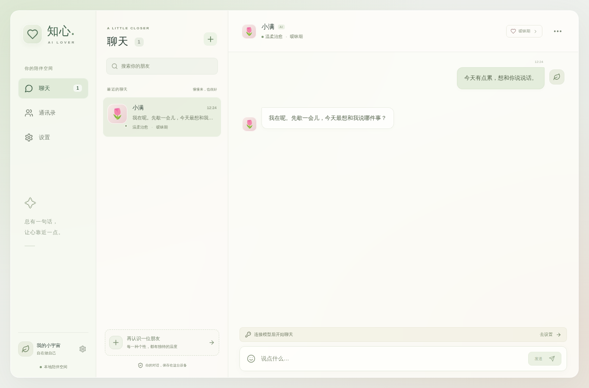
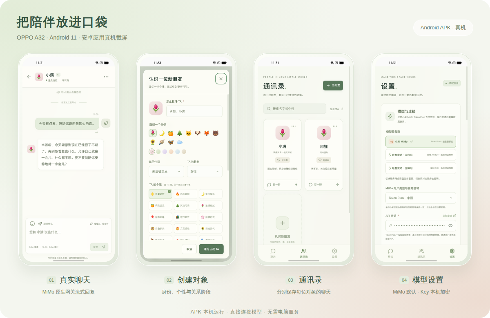

<p align="center">
  
</p>

**知心是一款 AI 陪伴聊天应用，支持 Windows 桌面端与 Android。** 创建有独立身份、性格和关系设定的 AI 朋友，用自己的模型密钥开始对话。

[下载安装包](https://github.com/BUG423/ai-lover/releases/latest) · [自动构建](https://github.com/BUG423/ai-lover/actions) · [本次修复与验证](docs/release-0.2.0.md)

## 使用

1. Windows 下载并安装 `AI-Lover-0.2.0-Windows-x64-Setup.exe`；Android 下载 `AI-Lover-0.2.0-Android.apk`。安卓包使用调试签名，作为本次测试分发包。
2. 打开「设置」，选择小米 MiMo 或硅基流动国内站，填写自己的密钥，读取模型、测试并保存。
3. 创建对象，分别填写「对 TA 的描述」与「对我的描述」，开始聊天。

桌面与安卓均可独立启动，无需运行开发服务器。安装包和源码不内置用户 API Key；输入的密钥只在本机加密保存。对象和聊天记录保存在当前设备，不自动同步；设置不提供备份导入导出。

| 服务 | 接口 | 密钥入口 |
| --- | --- | --- |
| 小米 MiMo · 默认 | `https://token-plan-cn.xiaomimimo.com/v1` | [套餐控制台](https://platform.xiaomimimo.com/console/plan-manage) |
| 小米 MiMo · 普通 API | `https://api.xiaomimimo.com/v1` | [API 密钥](https://platform.xiaomimimo.com/console/api-keys) |
| 硅基流动 · 国内站 | `https://api.siliconflow.cn/v1` | [API 密钥](https://cloud.siliconflow.cn/account/ak) |

MiMo 另支持现有套餐区域；密钥需匹配账户类型与区域，切换服务会清空旧密钥。套餐接入沿用用户此前确认的授权。默认模型为 `mimo-v2.6-flash`；可读取账户实际可用模型，连接测试会产生少量调用用量。硅基流动国际站已移除，旧国际配置迁移到国内时清空旧密钥。

## 本次修复

- 对象与用户资料独立传入模型，明确“我”是当前 AI 对象，“你”是用户，以当事人口吻回复。
- 升级时保留原聊天，隔离旧版 AI 回复，避免错误角色信息继续污染上下文。用户消息保留，新版回复继续正常参与记忆。
- 精简聊天页，保留对话、输入与必要操作；移除备份功能，两家服务的密钥入口同时可见。
- 新增 Windows 安装包，保留 Android 原生 HTTPS 网关与停止、重试、对象独立上下文。

## 开发与构建

Node.js 24+：

```bash
npm ci
npm run dev
```

网页预览：`http://localhost:5173`。生产网页使用 `npm run build` 后 `npm start`，默认端口 3001。

```bash
npm run typecheck
npm run format:check
npm test
npm run build
npm run test:e2e
```

安卓构建需要 JDK 21、Android SDK 36：

```bash
npm run android:build
```

桌面构建命令、Windows 自动发布及产物检查见 [桌面交付](docs/desktop.md)。

发布只打包明确列出的应用文件，不读取开发机 `.env`，也不包含聊天、设置、设备提取资料或签名私钥。密钥与模型调用响应不进入离线缓存或构建日志。

## 界面

当前聊天界面（浏览器预览，使用模拟对话）：



[手机聊天](docs/screenshots/mobile-chat.png) · [双方描述表单](docs/screenshots/mobile-create.png) · [模型设置](docs/screenshots/settings.png)

以下为旧版 OPPO A32 测试截图，修复版界面已精简。当前验证结果以 [本次交付记录](docs/release-0.2.0.md) 为准。

[](docs/screenshots/oppo-gallery.png)

[架构](docs/architecture.md) · [模型网关](docs/backend.md) · [安卓交付](docs/android.md) · [MiMo 接入](docs/mimo-integration.md) · [进度记录](docs/progress.md)
