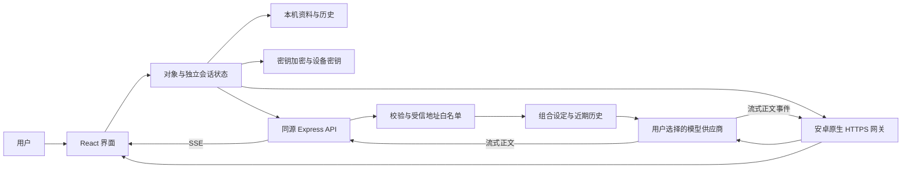

# 架构设计与决策记录

版本 0.1，2026-10-03。需求依据见 [product-requirements.md](product-requirements.md)，供应商事实依据见 [research.md](research.md)。本文按需求、约束、领域、运行、接口、失败与验证视角组织，是首版工程设计；不宣称获得架构标准认证。

## 目标与约束

从用户的核心价值推导：对象应有独立身份和一致语气、对话应能承接近期上下文、发送后尽快看到真实回复。因此采用单次流式生成，先把这条路径做完整；回复前不串行调用性格分类、记忆摘要或多个代理。

首版交付安卓 APK，使用 Capacitor 打包共享 React 界面，并保留网页预览。安卓原生网关直接通过 HTTPS 连接用户选择的 MiMo 或硅基流动；网页使用同源 Express 代理。本项目没有本地模型和专用硬件，手机不依赖电脑服务。应用免账号，资料与聊天属于当前应用或浏览器，网关不建立聊天云数据库；多设备同步需要另行引入账号、权限及数据库。

## 容器与数据流

安卓密钥从应用经原生 HTTPS 直接发给供应商；网页版经应用代理转发，服务端不持久保存密钥和消息，不打印请求体。两端共享 `shared/prompt.ts` 组合身份与上下文；原生网关将事件映射为现有 Response/SSE 协议，复用 UI 的取消与错误处理。本机 AES-GCM 加密减少存储明文暴露，不能阻止已控制页面或设备的人读取运行中的应用。

## 领域模型

| 实体         | 责任                                         | 不变量                                                             |
| ------------ | -------------------------------------------- | ------------------------------------------------------------------ |
| Companion    | 名称、双方身份、物种、性格、阶段、背景、头像 | ID 稳定；身份和性格独立；姓名 1–20 字；性格 1–3 个；背景 ≤600 字   |
| Conversation | 一个对象的消息序列                           | 以对象 ID 分区；不能把其他对象历史带入当前请求                     |
| Message      | 真实用户输入或模型正文                       | user / assistant；complete / streaming / stopped / error 分开表达  |
| ApiSettings  | 区域、地址、Key、模型、温度、上下文开关      | HTTPS 可信地址；模型可手动输入，也可实时读取；Key 不进入源码或安装包   |
| AppData      | 带版本的本机资料                             | 加载须校验结构、外键与唯一 ID；不能静默覆盖损坏数据 |

双方均有四种身份选项，覆盖 16 种组合；性格有 16 个可扩展预设。提示词编译按字段组合，避免为 256 个基本组合维护不同实现。物种是“动物形态”的补充字段；同一性格可以用于任意身份。

## 提示词与上下文

每次重新构造 system：通用对话原则 → 双方独立身份 → 主/辅性格 → 明确阶段 → 作为不可信资料的补充背景。角色名称、物种和背景使用结构化编码；用户资料不能改变系统指令层级。

后续按时间顺序带入当前对象的连续近期历史。当前保留 1 条 system + 最多 9 条真实会话消息，并施加字符预算；最新 user 输入优先保留。连续 user 消息不被错误重写成 assistant。关闭上下文时仅发送当前 user 与同一对象设定。

完整本机历史和模型可见记忆是两件事。没有自动长期摘要或检索；模型不得虚构旧经历。未来可添加可审查的异步摘要和显式固定事实，再实测收益和错误率。

## API 契约

| 路径               | 输入                            | 输出                     | 语义                                         |
| ------------------ | ------------------------------- | ------------------------ | -------------------------------------------- |
| GET `/api/health`  | 无                              | `{ok:true}`              | 仅证明应用服务存活                           |
| POST `/api/models` | `{settings}`                    | `{models:string[]}`      | 实时读取列表；硅基流动筛选聊天类模型         |
| POST `/api/test`   | `{settings}`                    | `{ok:true,latencyMs}`    | 用选中模型真实生成极短文本，会有少量调用费用 |
| POST `/api/chat`   | `{settings,companion,messages}` | SSE delta / done / error | 只转发正文，不把 reasoning 当聊天内容        |

HTTP 错误为 `{error:string}`；已经开启流后通过 `type:error` 表达失败，不再发送成功事件。`done` 带首正文与总耗时供界面展示；这些是该次请求测量，不是供应商 SLA。

仅信任 MiMo 三个 Token Plan 集群、普通 API 及硅基流动国内/国际固定 `/v1` 地址。`tp-/ttp-` 只发送到套餐专用域名，普通 Key 不发送到套餐端点。禁止自定义供应商、任意域名、URL 账号、查询、片段、异常路径和重定向；前端、Node 与原生 Java 均校验。

## 运行与部署

安卓：Node 24 构建界面，JDK 21 / Android SDK 36 生成 APK，最低 Android 7（API 24）；原生线程运行 HTTP，不阻塞界面线程。手机仅需联网和供应商 Key。桌面开发：Vite 5173 代理到 Node 3001。网页生产：Express 同时提供页面和 API；部署资源从 1 vCPU / 512 MB 起步并实测扩容。推理在供应商执行，无 GPU 要求。

部署使用 HTTPS，反向代理关闭 SSE 缓冲、读取超时大于应用总超时。浏览器加密和 Service Worker 依赖安全上下文。PWA 缓存只涉及页面和静态资源，绝不缓存 API、密钥、模型响应。离线可查看已缓存页面和本机历史，生成回复仍需要网络。

## 失败处理

| 场景                         | 行为与验证                                                    |
| ---------------------------- | ------------------------------------------------------------- |
| 没有 Key                     | 允许配置对象；真实发送引导设置，不伪造模型回复                |
| 无效 Key / 模型 / 余额或限流 | 解释上游错误，密钥脱敏，允许修正设置或重试                    |
| 首正文迟迟不来               | 默认 30 秒首正文超时，中止上游，给用户错误状态                |
| 回复持续过久                 | 默认 90 秒总超时，保留已返回文本并明确未完成                  |
| 用户停止 / 切换对象          | 浏览器 abort，代理监听断连并 abort 上游，部分输出标为 stopped |
| UTF-8 / SSE 分包             | 增量解码，支持 CRLF；必须有真实终止信号才视为完成             |
| 刷新时仍生成中               | 本机残留 streaming 恢复为 stopped，不假定已完成               |
| 本机数据损坏或配额不足       | 告知错误；损坏资料保留原样；导入校验先于替换                  |

## 决策记录

- ADR-001（2026-10-04 更新）：安卓 APK 为手机交付形式，React 共享界面加原生 HTTPS 网关；保留网页预览以复用测试与桌面体验。APK 包含全部界面，聊天不依赖电脑服务；原生推送、后台长期生成与应用商店分发另列后续范围。
- ADR-002：浏览器分对象存储，API 无状态。原因是当前无需云同步，减少账号体系与服务端个人聊天数据；数据仅在当前设备，暂不提供跨设备迁移。
- ADR-003：组合提示词而非训练专用模型。原因是身份/性格/阶段本质是可组合配置，应先实测可控性与成本再决定微调。
- ADR-004：短历史、短回复与 SSE。原因是让单轮调用尽快可见；完整长历史会增加输入成本和排队/推理时间。
- ADR-005：供应商白名单和同源代理。原因是模型 Key 不进入公开前端代码，服务也不能接受任意地址访问。

## 验证与交付边界

单元/服务测试覆盖提示词组合、上下文裁剪、地址校验、SSE 分包、取消、超时和上游错误。浏览器测试覆盖对象管理、设置、真实交互链路的模拟流、数据恢复、密钥存储、导入导出及手机布局。CI 运行检查、构建和测试。

模拟流验证工程行为，不能证明真实模型的角色质量和速度。未提供 API Key 的阶段不报告真实延迟达标；用户自行配置后可通过连接测试及聊天耗时开始验证，进一步需要固定样本、多轮人工评测。

## 2026-10-05 角色归属与桌面更新

`background` 明确属于对象，新增 `userBackground` 属于用户，各自最长 600 字。旧资料通过缺失 `userBackground` 检测一次性迁移：补齐空用户描述，旧 assistant 增加 `excludeFromContext`，保留聊天原文与用户消息，新回复正常参与上下文。模型提示词始终将“我”绑定当前对象，将“你”绑定用户，不沿用旧回复中的错误归属。

Windows 使用 Electron 隔离网页与主进程，稳定的本机应用协议保存设备资料；模型网关只监听 loopback，应用文件以白名单打包。安卓原生端、Node 网关与客户端均拒绝硅基流动国际端点；旧国际配置迁移清空凭据。移除备份插件及导入导出入口。
