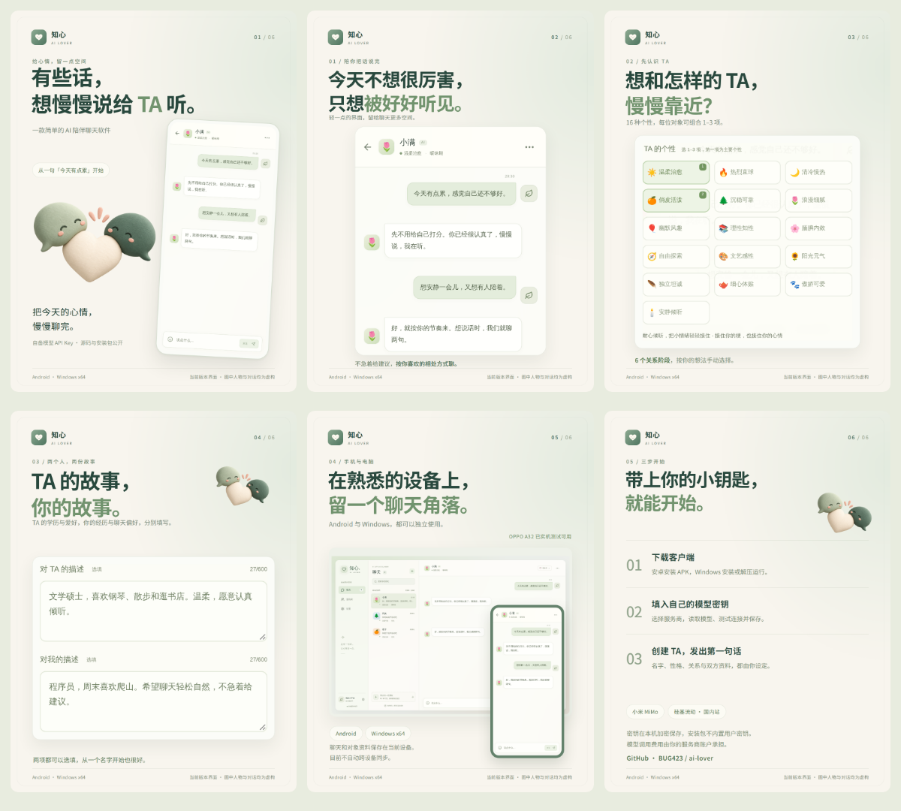

# 知心 · AI Lover｜小红书介绍素材

六张 **1080 × 1440 PNG**，建议按编号顺序发布。第 1 张作封面；标题、正文、短版、逐图配文与话题见 [copy.md](copy.md)，纯文本版本见 [copy.txt](copy.txt)。

[下载六图与文案 ZIP](https://github.com/BUG423/ai-lover/releases/download/v0.2.1/AI-Lover-0.2.1-Xiaohongshu.zip)



| 顺序 | 图片                             | 内容                                       |
| ---- | -------------------------------- | ------------------------------------------ |
| 1    | [封面](01-cover.png)             | 有些话，想慢慢说给 TA 听                   |
| 2    | [对话](02-conversation.png)      | 今天不想很厉害，只想被好好听见             |
| 3    | [性格与关系](03-personality.png) | 16 种个性、6 个手动关系阶段                |
| 4    | [双方资料](04-profiles.png)      | TA 与我的独立描述                          |
| 5    | [双平台](05-platforms.png)       | Android / Windows x64，OPPO A32 已测试可用 |
| 6    | [使用步骤](06-start.png)         | 自备 MiMo 或硅基流动国内站密钥             |

图中的对象资料与聊天是专门编写的虚构示例。界面使用 v0.2.1 客户端的共用代码渲染，外部的设备边框仅用于展示。没有使用手机里的私人聊天或真实 API Key。手机与电脑分别保存资料，当前不自动同步；模型调用费用由使用者的服务商账户承担。

## 修改与重新导出

图片排版源文件为 [render-promo.mjs](../../../scripts/render-promo.mjs)，示例界面采集源文件为 [capture-promo.mjs](../../../scripts/capture-promo.mjs)。它们是内部文档工具，不提供网页端产品。

安装项目依赖后，在两个终端分别运行：

```bash
# 终端 1：仅在本机临时渲染共用客户端界面
npx vite --host 127.0.0.1 --port 5173

# 终端 2：采集虚构示例，再导出六图与 README 图片
node scripts/capture-promo.mjs
node scripts/render-promo.mjs
```

默认使用系统中文字体。原图采用 Noto Sans SC；如有本地字体文件，可指定 `PROMO_FONT_FILE=/path/to/NotoSansSC.ttf` 后运行导出脚本。采集器使用独立的临时浏览器环境，并阻止服务商请求；它不会读取真实设备或桌面客户端的用户资料。

装饰插画由内置 **imagegen** 生成，提示词保存在 [illustration-prompt.txt](illustration-prompt.txt)，项目素材为 [companion-illustration.png](../../media/companion-illustration.png)。准确的中文文字、应用图标和界面由代码排版；未使用图像模型编造软件截图。

`preview.png` 为六图总览，供选图使用。发布时上传编号 01–06 的原尺寸图片即可。
